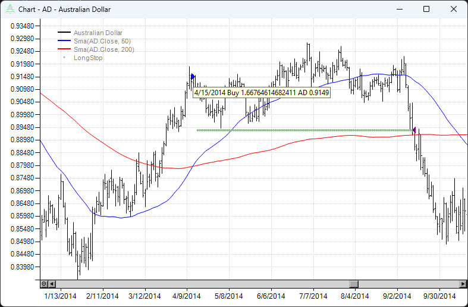
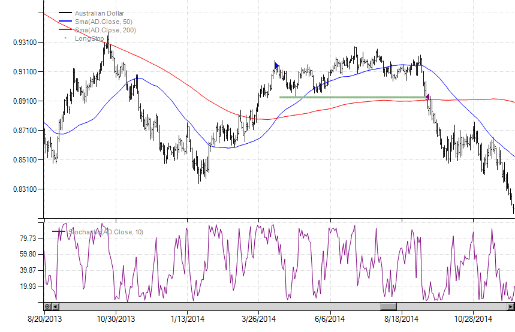
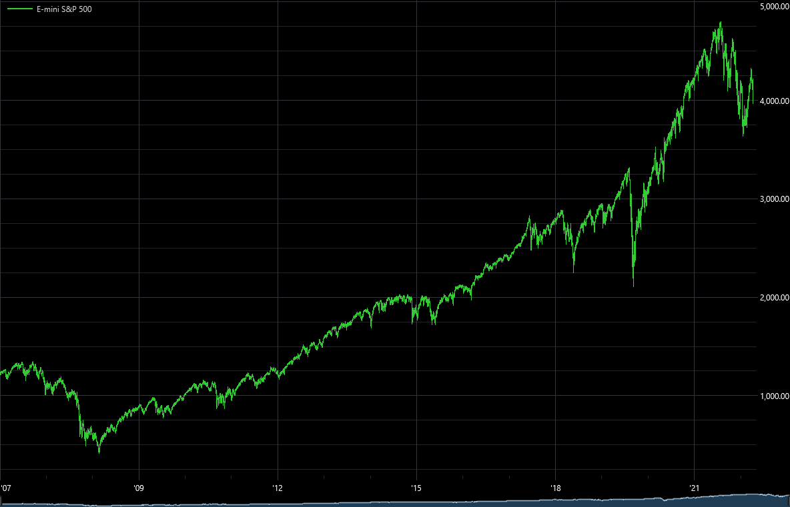

# Charting
The backtester supports several different charting tools for strategy and data visualization. The simplest of these is the `Chart` extension method which can be called directly on any object that implements the `ISeries` interface (`TimeSeries`, `BarSeries`, etc.).

## Strategy charting
You can also call the `Chart` method on strategies themselves. This will automatically plot the `PrimarySeries` and any entry and exit signals for trades. Typically you'll also want to see indicators which may be inputs into your strategy. This is done via calls to the `Plot` method in `OnStrategyStart`. Below we modify our `SimpleSma` strategy to plot the short-term SMA in pane 0, by convention the main price pane. The second call plots the long term SMA also in the main pane. The final call takes advantage of a built-in `PlotInstruction` constant to plot stops that were assigned to a position in `OnPositionOpening`. You can also create and plot a `PlotInstruction` object for more fine-grained control.
```c#
protected override void OnStrategyStart()
{
    Col1 = Sma(Close, ShortLength);
    Col2 = Sma(Close, LongLength);
    Col3 = Atr(21);

    Plot(Col1, 0, Color.Blue);
    Plot(Col2, 0, Color.Red);
    Plot(PlotInstruction.PlotStops);
}
```
If we run the strategy on a symbol and call `Chart` we will see something similar to this:



The 50 period SMA is in blue, the 200 period is in red and the protective stop is shown by the green dots. Long entries are denoted by a right facing blue triangle (short entries are red) while exits are denoted by a left facing purple triangle. You can see at a glance that this trade was exited on the stop well before the moving averages crossed. If you hover your mouse over the buy/sell markers, a tooltip will pop up showing relevant information about the trade. You can use the mouse to zoom in and the escape key to zoom back out. Right clicking on the chart will bring up other options including a data window with crosshairs, the ability to copy to the clipboard, change the chart scaling, etc. It's always a good idea to visually inspect a chart to make sure your trading logic is working as intended.

Let's say we wanted to add an indicator to a new pane. Below we add a 10 period raw Stochastic indicator and set the pane size to one third of the total vertical area.
```csharp
Plot(Stochastic(10), 1, Color.Purple, paneSize: 33f);
```
If we re-run the strategy and call `Chart()` we'll see a new pane has been added and sized appropriately.



## Advanced charting
The charting code discussed above leverages the data visualization classes built-in to the .NET framework. When working with daily data or small amounts of intraday data, say hourly bars or above, the performance is accetable. However, for large amounts of higher frequency data like 1 minute bars, the advanced charting component is required. These charts can display very large amounts of data with unlimited zoom capabilities. For example, the chart below is comprised of approximately 5.5 million one minute bars. To create charts with this tool, call the `Chart2()` extension method on your data series or strategy.



> [!NOTE]
> The advanced charting component is available as a separate NuGet package and requires your code to be run without the debugger attached (Ctrl+F5 in Visual Studio).