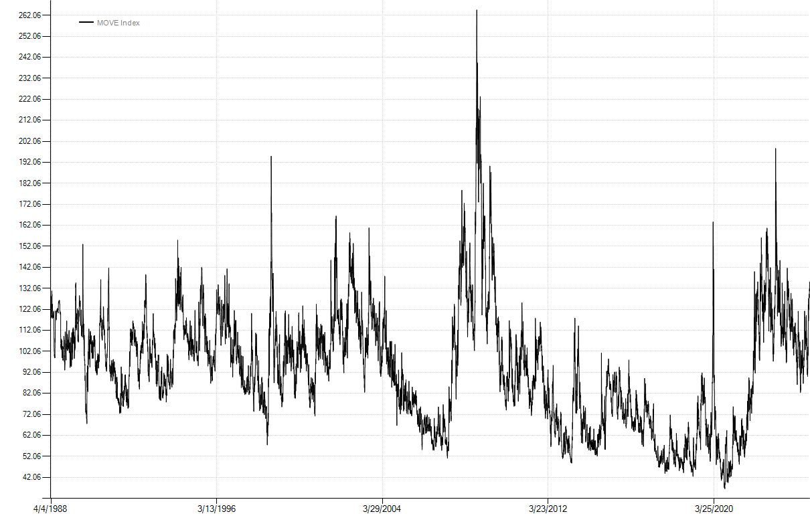

# Data
Data is the lifeblood of any quantitative or systematic strategy. Before you can do any testing, you need to get data into the system.  But first, there are a few foundational classes you will need to understand.
## TimeSeries
 A `TimeSeries` encapsulates an array of numeric values as well as their associated dates. In fact, `TimeSeries` act just like arrays in other programming languages so you can reference values via an indexer like `[0]`. Typically you won't create a `TimeSeries` directly but rather will load data from a file or call an indicator that returns a `TimeSeries` object. For example, loading a csv file with a date and observation on each line is as simple as calling:

```csharp
var ts = TimeSeries.Load(@"c:\data\MOVE Index.csv");
```
You can then examine several properties of interest:
```csharp
ts.Count //number of observations
ts.FirstDate //first date in the series
ts.LastDate //last date in the series
ts.Symbol //symbol inferred from the filename
```
As well as visualize the data by calling the Chart() extension method:
```csharp
ts.Chart();
```

## Bars, BarSeries and BarSeriesCollections
The next foundational class is the `Bar`. The standard `Bar` class contains `Date`, `Open`, `High`, `Low`, `Close`, `Volume`, `OpenInterest`, and `UnadjustedClose` properties. `ContinuousBar` is used for continuous futures data and extends the `Bar` class by adding a `DeliveryDate` property. The `Bar` class is extensible by design so additional fields can be included beyond the defaults. For example, you could load the S&P 500 OHLC (open, high, low, close) and also include the dividend yield as an extended property.

Like `TimeSeries`, we typically won't create bars directly, but rather will load them from a data source.  A single bar in isolation is of little use, so we will be working with `BarSeries`, a collection of bars ordered by date. Along with `TimeSeries`, `BarSeries` are one of the most commonly used data classes. Backtests run on `BarSeries`. Just like `TimeSeries`, you can load `BarSeries` directly from a text file:

```csharp
var data = BarSeries.Load(@"c:\data\BCOM Index.csv");

//you can enumerate bars
foreach (var bar in data.Take(10))
{
    Console.WriteLine(bar);
}

//or get a TimeSeries of just the bar's closing prices
var close = data.Close; 
//and of course you can chart a BarSeries as well
data.Chart();
```
## Other series
- `BooleanSeries` contain true/false values and are commonly used to indicate a distinct event, for example when an indicator value crosses above a certain level.

- `IntegerSeries` work just like `TimeSeries` but store integer values instead of floating point double values.

- `DateSeries` encapsulate a list of dates only. This can be useful in backtesting for keeping track of dates that correspond to events like FOMC announcements or economic releases.

## BarServers
It's tedious to specify a filename to load data so we usually rely on a `BarServer` to return a `BarSeries`. By using a `BarServer` we only have to specify the directory once and then we can load `BarSeries` by symbol. The backtester has quite a few bar servers built in which can be found in the `Balsam.DataServers` namespace. A few of the most commonly used include:

### Ascii BarServer
One the simplest is `AsciiBarServer`, which as the name implies, loads ASCII or plain text files. It can be used on its own or it can be extended to provide additional functionality like the `CsiBarServer` we cover next. Rather than calling `BarSeries.Load()` and passing in a filename, typically you would do something like this:

```csharp
 var server = new AsciiBarServer(@"c:\data\temp");
 var bcom = server.LoadSymbol("BCOM Index");
 var data = server.LoadAll();
```

- In line 1, we create a new `AsciiBarServer` for data found in the C:\data\temp directory. Unless directly specified, the file format will be automatically inferred for common formats (e.g. DOHLC as used here). Additional overloads to the constructor allow you to specify the file extension, delimiter (comma, tab, etc) as well as the file layout.
- In line 2, `LoadSymbol()` returns a `BarSeries` of the BCOM index.
- In line 3, the call to `LoadAll()` returns all the data in the specified directory as a `BarSeriesCollection`.  As its name implies, a `BarSeriesCollection` is a collection of one or more `BarSeries`.  It can be indexed by ordinal position within the collection (e.g. `data[0]`) or by symbol (e.g. `data["BCOM Index"]`). `BarSeriesCollection` is useful for portfolio testing to run a backtest across multiple symbols simultaneously.

### CSI BarServer

 Futures traders often perform research on backadjusted contracts.  One commonly used end-of-day data provider is [CSI](https://www.csidata.com/). Their Unfair Advantage software can output files in a variety of formats, but ASCII is unbeatable for its simplicity and iteroperability.  The backtester has a specialized `AsciiBarServer`, `CsiBarServer` designed to read text files output by Unfair Advantage. By convention, backadjusted files should be output using the following CSI format: "DOHLCVIUN", short for:

- Date
- Open
- High
- Low
- Close (settlement)
- Volume
- Open interest
- Unadjusted close
- Delivery code

The `CsiBarServer` will load these bars as a `ContinuousBar`, a subclass of `Bar` which includes an additional property `DeliveryDate`. `CsiBarServer` also handles some symbol translations automatically, adjusting prices to exchange convention in some cases (HG, SI, JY) and using a more industry standard tickers in others (EC instead of CU for the Euro).

### Binary BarServer

The `BinaryBarServer` reads data stored in a custom binary format. Binary tends to be much quicker to load at the expense of not being able to view or edit the data with a text editor or Excel. But when working with large amounts of data, the time savings from using a binary format become significant. In the simple benchmark below, we load approximately 13 years of one minute intraday data containing ~4.8 million bars. On a modern machine with a NVMe SSD drive, the ASCII data loads in about 7.5 seconds. That same data stored in a binary file loads in just over a second. Binary files also store instrument metadata eliminating the need for a separate instrument file unless desired.

```csharp
internal class Program
{
    static void Main(string[] args)
    {
        IBarServer server = new AsciiBarServer(@"c:\data\intraday\continuous");
        var sw = Stopwatch.StartNew();
        var data = server.LoadSymbol("@ES");
        sw.Stop();
        Console.WriteLine($"{data.Count:N0} ascii bars loaded in {sw.Elapsed}.");

        data.Save(@"c:\data\temp\@ES.bin", PersistenceFormat.Binary);
        server = new BinaryBarServer(@"c:\data\temp");
        sw = Stopwatch.StartNew();
        data = server.LoadSymbol("@ES");
        sw.Stop();
        Console.WriteLine($"{data.Count:N0} binary bars loaded in {sw.Elapsed}.");
    }
}
```
```
4,769,984 ascii bars loaded in 00:00:07.6500165.
4,769,984 binary bars loaded in 00:00:01.1827305.
```
### Other BarServers
- `Tiingo` is an excellent free or inexpensive data source for equities. Visit [Tiingo](https://www.tiingo.com/) to register and get a personal API key.
- `TradeStationBarServer` is a specialized `AsciiBarServer` for reading data exported from a TradeStation Data Window.
- `FREDServer` allows retrieval of many economic series, including point-in-time data, from the St. Louis Federal Reserve's excellent [FRED](https://fred.stlouisfed.org/) service. Register for a free API key.
- `BloombergBarServer` interfaces directly with Bloomberg to retrieve data via their Desktop API. Licensed as a separate entitlement from the core backtester.
- Or build your own bar server by overriding a few methods of the abstract `BarServer` base class.

### Futures Data
Futures contracts have a finite life. Therefore, system testing is often done using continuous or "backadjusted" contracts. Backadjusting is a process by which individual futures contracts are spliced together to create one continuous series. This continuous series replicates the P&L of holding a futures contract while rolling it from month-to-month. Below is an example of what historical futures data might look like:
|Date|Open|High|Low|Close|Volume|Open Interest|Unadjusted Close|Delivery|
|----|----|----|----|----|----|----|----|----|
19840913|663.07|666.70|661.85|666.55|73100|33100|169.30|Sep-84
19840914|667.35|668.25|665.95|666.40|73800|33600|169.15|Sep-84
19840917|666.60|667.35|665.60|666.55|64300|37000|173.00|Dec-84
19840918|666.35|667.05|665.55|666.15|63700|37900|172.60|Dec-84

On 9/17/1984 there was a roll from the September contract to the December contract. Note the unadjusted close on September 17th at 173 versus 666.55 for the backadjusted close. The unadjusted close is the price that existed *at that point in time* free of the cumulative effects of backadjusting. Having the unadjusted close is critical for calculating accurate percentage changes, especially as the amount of history increases.  

One common mistake is calculating percentage changes directly on backadjusted prices. The correct calculation for the percent change on 9/17/1984 is the point change in the backadjusted closing prices divided by the unadjusted close from the prior day:

- (666.55 - 666.40) / 169.15 = 0.000887

*not*

- ~~666.55 / 666.40 - 1 = 0.000225~~

and also *not* the change in unadjusted closes because of the roll on that date
- ~~173.00 / 169.15 - 1 = 0.022760~~


 Considering that backadjusted prices can actually go negative, which introduces even more severe distortions to percentage calculations, it is important to be aware of this. Fortunately the backtester automatically uses the unadjusted close as the denominator whenever appropriate and when available in the data source.
