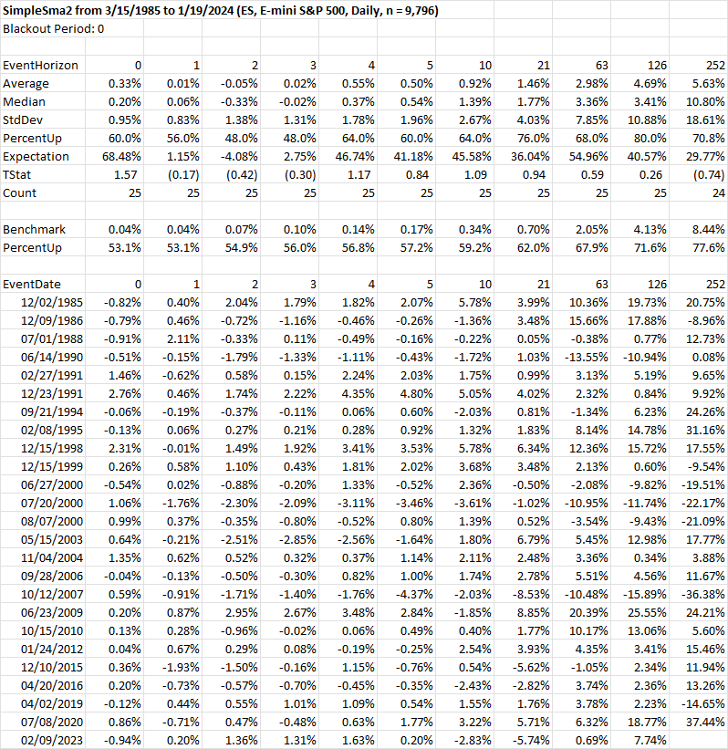
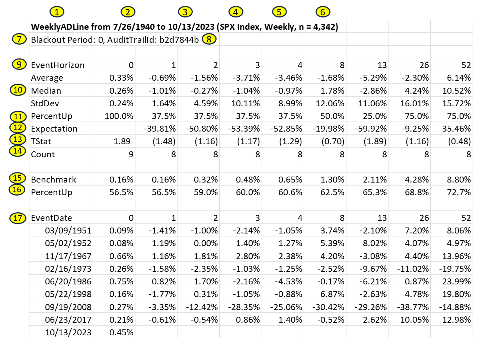
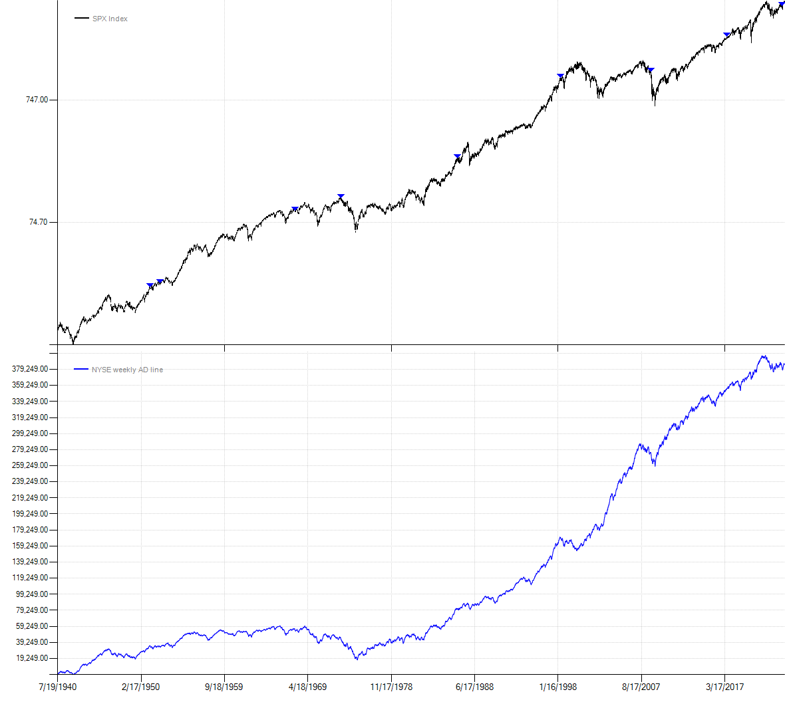

# Event Studies
Sometimes you want to quickly examine what happens to a market after a particular condition is observed. Event studies are an easy way to quantify a potential "edge" for a single market without having to code entry and exit logic to run a full blown backtest. Below we modify our `SimpleSma` strategy to support an event study. Instead of submitting buy or sell orders, we simply call `SnapEvent()` when the 50 period SMA crosses above the 200 period. You can also pass an optional value to the `SnapEvent()` method for display in the detail section of the event study report.
```csharp
class SimpleSma : Strategy
{
    public int ShortLength { get; set; } = 50;

    public int LongLength { get; set; } = 200;

    protected override void OnStrategyStart()
    {
        Col1 = Sma(Close, ShortLength);
        Col2 = Sma(Close, LongLength);
        Col3 = Atr(21);

        Plot(Col1, 0, Color.Blue);
        Plot(Col2, 0, Color.Red);
    }

    protected override void OnBarClose()
    {
        if (CrossAbove(Col1, Col2).Last)
        {
            SnapEvent();
            //SnapEvent(CurrentDate.DayOfWeek.ToString()); //pass an arbitrary piece of data to be dipslayed in the event study report
        }
    }
}
```
Next, run the simulation as normal and then call the extension method `EventStudyReport()`. This will create an event study report and export it to Excel.
```csharp
var strat = new SimpleSma();
strat.PrimarySeries = new CsiBarServer(@"c:\data\csi").LoadSymbol("ES");
strat.RunSimulation();
strat.EventStudyReport();
```
The report contains three main sections: 
- summary statistics for all event horizons
- benchmark returns, or the average unconditional return for the instrument tested across all horizons
- return details for individual events

 From the summary we can see there have been 25 prior instances of a positive 50/200 period SMA cross in S&P 500 futures. A horizon of zero denotes the time the event occurred. Horizons of 1, 2, 3, etc. are the number of periods in the future relative to the event. All return statistics are *cumulative* returns since the time of the event. When testing on backadjusted futures contracts as in this example, the backtester will automatically use the unadjusted close to calculate accurate percentage returns (assuming of course that the unadjusted close is available in your data source.)



## A more realistic example

Below we'll walk through a more realistic example of an actual event I wanted to quantify. On 10/13/2023, I noticed the S&P 500 cash index had rallied for two consecutive weeks on negative NYSE breadth (i.e. both weeks saw more declining issues than advancing ones). This seemed fairly unusual and worthy of further investigation.

```csharp
class WeeklyADLine : Strategy
{
    public static void Run()
    {
        AsciiBarServer server = new AsciiBarServer(@"c:\data", AsciiBarServer.DOHLC);
        var data = server.LoadSymbol("SPX Index", new DateTime(1940, 7, 19)).Compress(new WeeklyCompression() { UseFixedDates = true });

        var strat = new WeeklyADLine();
        strat.PrimarySeries = data;
        strat.RunSimulation();
        strat.EventStudyReport();
        strat.Chart();
    }

    protected override void OnStrategyStart()
    {
        AsciiBarServer server = new AsciiBarServer(@"c:\data\mktdata", AsciiBarServer.DC);
        var adv = server.LoadSymbol("advances").Close;
        var dec = server.LoadSymbol("declines").Close;

        Col1 = Cumulative(adv - dec);
        Col1.Name = "NYSE weekly AD line";
        Col2 = Indicators.Consecutive(Close);
        Col3 = Indicators.Consecutive(Col1);

        Plot(Col1, 1, Color.Blue, paneSize: 50f);
    }

    protected override void OnBarClose()
    {
        if (Col2.Last == 2 && Col3.Last <= -2)
        {
            SnapEvent();
        }
    }
}
```
### Code discussion
In `OnStrategyStart()`, I loaded weekly NYSE advance decline line data. On line 21 I calculate the advance-decline line. 'adv' is a `TimeSeries` of advancing issues and 'dec' is a `TimeSeries` of declining issues. You'll recall from the [Data](Data.md) page that `LoadSymbol()` returns a `BarSeries`. Since the data format I'm using is close-only, I call `.Close` to retrieve a `TimeSeries` of just the closing prices. Note how the data format was specified in the `AsciiBarServer` constructor call on line 17 where we passed a static format constant `AsciiBarServer.DC` which is short for 'Date', 'Close'.

By subtracting declines from advances we arrive at weekly net breadth. Next, I calculate the actual advance-decline line by passing net breadth into the `Cumlative` function. While this wasn't strictly necessary to quantify the event, I wanted to be able to plot the AD line which is done with the call to `Plot()` on line 26. On line 22 I set the `Name` property of the `TimeSeries` for display in the chart legend.

The backtester has many built-in convenience methods like the call to `Cumulative()`. These calls in turn delegate to the static `Indicators` class which contains many more technical indicators and statistical functions. On lines 23 and 24 I use the `Consecutive` indicator from this library to return the consecutive number of periods a `TimeSeries` has moved up or down relative to the prior observation.

Within the `OnBarClose()` method on line 31 I set up the actual event criteria. If the S&P is up exactly two weeks in a row while the advance-decline line is down two *or more* weeks in a row, we "snap" the event or save it for later analysis.

How do I know it's the *weekly* S&P close you might ask? That's because I set the `PrimarySeries` of the strategy to use weekly S&P prices on line 9. You'll find setting the `PrimarySeries` of a strategy from outside the class is a common usage pattern. Since backtests and event studies are calculated on the `PrimarySeries` of a strategy, this allows you to run simulations using different data without having to modify the class itself. For example, if I wanted to see how the Nasdaq responds to negative NYSE breath, all I would have to do is change the symbol on line 6 (assuming that symbol exists in your data directory of course.)

On line 3 I created a static method to perform the setup needed to run the event study. I loaded historical S&P data on line 6, passing in a start date to align with the beginning of my advance-decline data. The S&P data is daily but my breadth data is weekly and uses a Friday date by convention, even if Friday was a holiday. Although the backtester can handle mixed periodicities and missing dates across different series, lining up all the data ahead of time simplifies things. So I compress the daily S&P data to weekly by calling `Compress` and passing in a `WeeklyCompression` object instructing it to use fixed dates.

Starting on line 8, I instantiate the strategy, set the `PrimarySeries` to the weekly data, run the simulation, and finally create the event study report by calling the `EventStudyReport()` extension method. To launch this code in Visual Studio I would have called the static `WeeklyADLine.Run()` method from the main program entry point, by default the `Main()` method in a Console application. This is another common usage pattern--creating a static `Run()` method to contain all the initialization code needed to run a particular strategy or event study.

## Decoding results
Below is the output of the `WeeklyADLine` event study report along with explanations of key pieces of information.



1. Event study name
2. Start date. The date after which all indicators have been initialized and we start recording events.
3. End date
4. Instrument being tested
5. Periodicity
6. Number of observations
7. A blackout period prevents repeat observations over n periods from the initial event to prevent double-counting. A value of zero disables it (i.e. all events are recorded no matter the sequence).
8. Audit trail id (if shown) is an internal reference number for code that is automatically saved so that a study may be recreated at a later date.
9. The event horizon is the number of periods relative to an event. A value of zero is the event itself. Positive numbers are n periods after the event. Negative numbers, if shown, are n periods prior to the event.
10. Summary statistics calculated across all events use cumulative returns relative to the event date.
11. The percentage of positive returns observed for a specified horizon.
12. Expectation is calculated as (Avg Win / Abs(Avg Loss)) * PercentUp * (1 - PercentUp) and attempts to quantify the edge.
13. T-statistic comparing returns relative to the benchmark. T-stats of +/- 2 or more are automatically highlighted in yellow for event horizons greater than zero.
14. The number of events recorded at a particular horizon. Note how there is one more observation at a horizon of zero since an event was recorded at the end of the sample period. This is often the case as we are typically studying an event that just happened.
15. The average return for the instrument across all periods. In this example, the average 52 week return across the sample period for the S&P is 8.8%. Note the horizon of zero is a special case and is identical to the 1 period return.
16. The percent of time the benchmark had positive returns over the specified horizon.
17. Event detail showing the date of an event and the subsequent cumulative returns over n horizons. Returns are reported cumulatively relative to event date. Returns for back-adjusted futures contracts are reported as the point change divided by the unadjusted contract price at the time of the event. The return for a horizon of zero is just the return for the period on which the event occurred. In this example, the S&P returned 0.45% for the week ending 10/13/2023.

## Event study charting
Charting also supports event studies by placing markers at dates where an event was "snapped" allowing for easy visual inspection.


