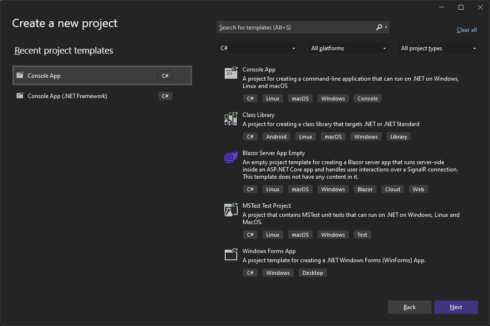
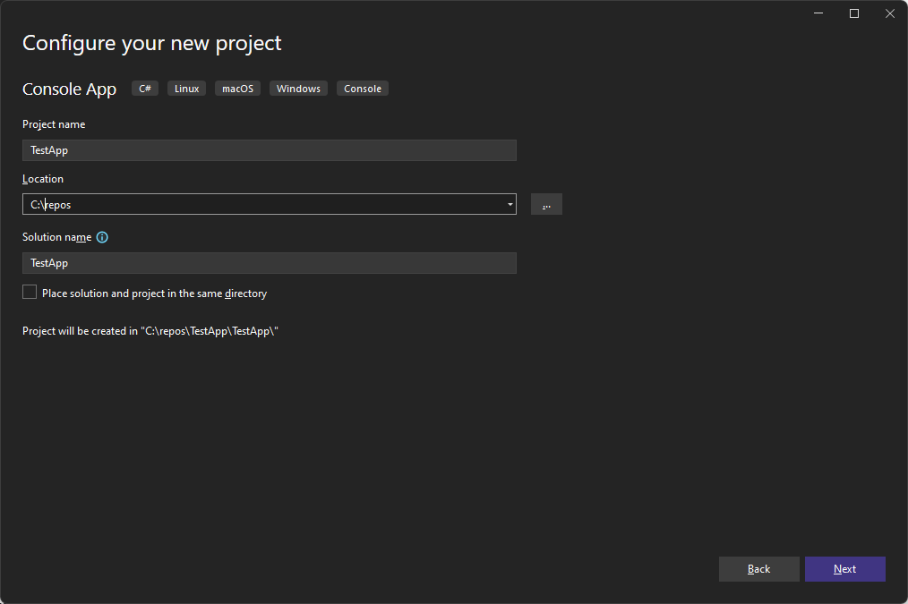
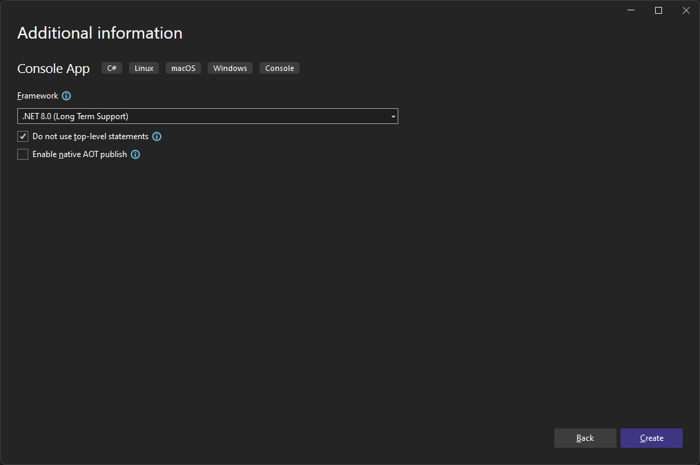
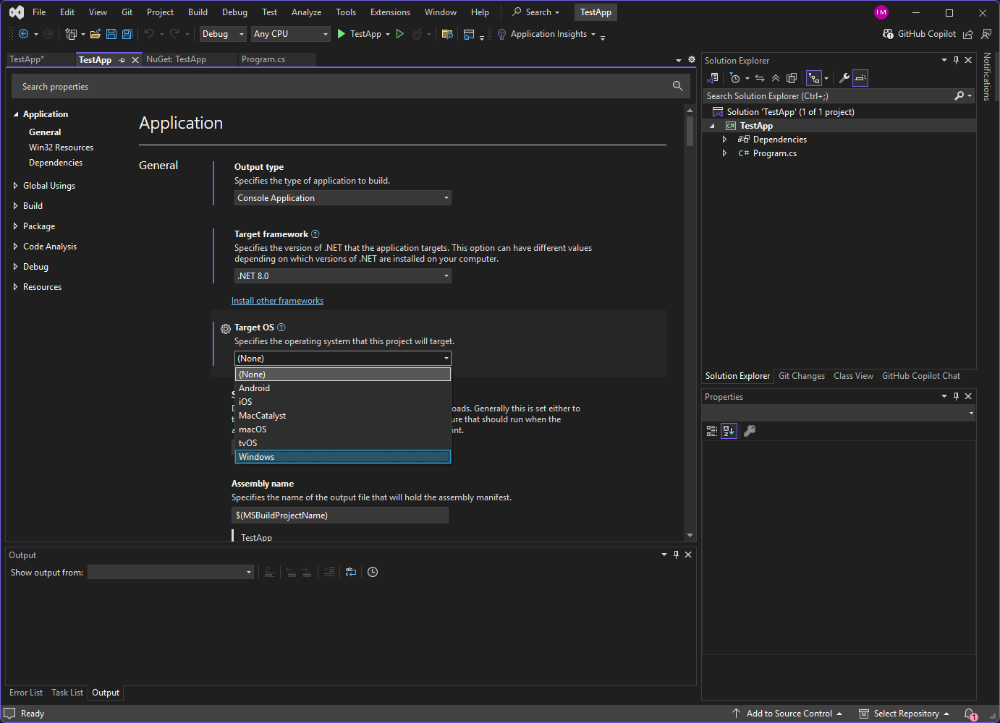
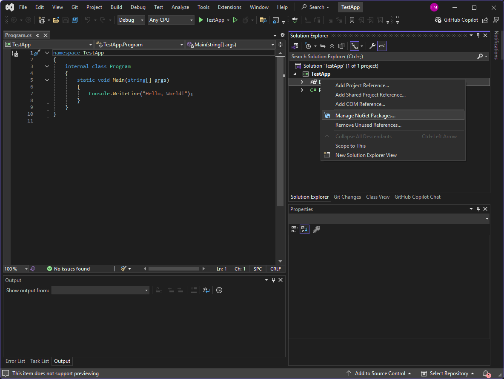
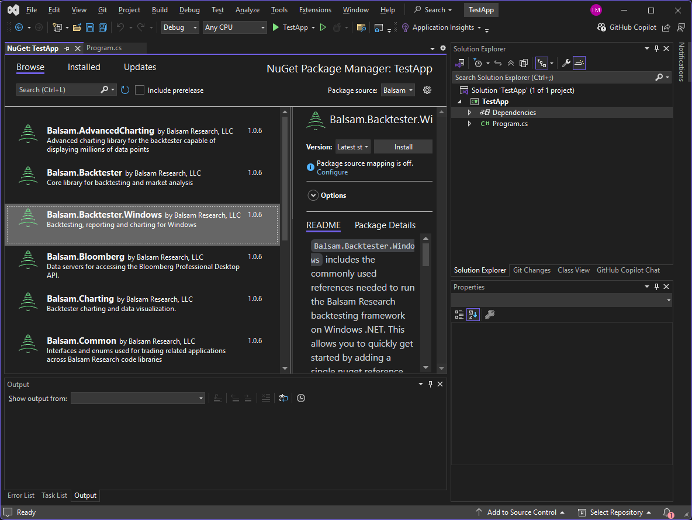

# Getting Started
## Creating your first project
> [!NOTE]
> The following instructions assume you are using Visual Studio 2022 on Windows. > The procedure should be broadly similar for other IDE's

From Visual Studio, create a new project. For the project type, select Console App. If you don't see it, use the template search box at the top. Do *not* select 'Console App (.NET Framework)' which is for the legacy .NET Framework. Once you have the correct template, click 'Next'.

Give your project a name and click 'Next'.

In the Framework drop down select the target framework as desired. For new installations of Visual Studio this will typically be .NET 8.0 or later. Click 'Create'.

You should now see the stub of a new project. In the Solution Explorer, select the project ('TestApp' in this case), right click and choose 'Properties'. In the 'Target OS' dropdown, select Windows. In the examples that follow, we will use some of the backtester's charting capabilities that require Windows specific functionality.

 Go back to the Solution Explorer, right click on Dependencies and select 'Manage NuGet Packages'.

From the NuGet 'Browse' tab, search for Balsam and select `Balsam.Backtester.Windows`, a 'meta-package' that references the key libraries used in most common scenarios: `Balsam.Backtester`, `Balsam.Charting`, and `Balsam.Reporting`. Click 'Install'. After familiarizing yourself with the license agreement, accept to continue installation.

Next we will cover some basic concepts starting with [Data](Data.md).