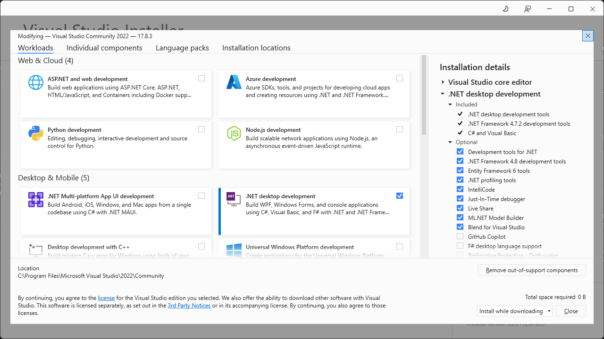

# Installation
## Requirements
While the backtester is cross-platform, for most users we recommend the following:
- Windows 10 or higher
- [Visual Studio](https://visualstudio.microsoft.com/) (recommended), [VS Code](https://code.visualstudio.com/), or a similar IDE capable of working with .NET code
- Microsoft Excel for reporting.

## Visual Studio setup
[Visual Studio](https://visualstudio.microsoft.com/) is the flagship integrated development environment (IDE) from Microsoft. It is an extremely capable and mature product. Even better, the Community Edition is available free for individuals and small companies. If you are installing Visual Studio for the first time, make sure to select ".NET desktop development" when prompted for workloads. This will install the .NET components needed to run the backtester, as well as C#, the language used in this documentation.




## Licensing
Please take a moment to read the [license agreement](../EULA.md). The backtester software is licensed and uses a cryptographic key tied to your physical machine. The standard license allows a *single* user to activate the license on a primary machine and one backup machine (e.g. laptop for travel). Please [contact us](mailto:info@balsamresearch.com) with any questions, to request a trial key, or for offline licensing options.

## Activation
Activation is a one-time procedure. From a command prompt, install the Licensing Tool by typing:
```
dotnet tool install Balsam.LicensingTool --global
```
> [!NOTE]
> This assumes you already have Visual Studio or VS Code installed with the appropriate workload for .NET desktop development.

Upon successful installation you should see a message similar to this:
```
You can invoke the tool using the following command: Balsam.LicensingTool
Tool 'balsam.licensingtool' (version '1.0.6') was successfully installed.
```

After the licensing tool has been installed, activate your machine by entering the following in the command prompt, replacing 'xxxx' with your actual license key pasted from the clipboard (license keys are quite long).
```
balsam.licensingTool activate --key xxxx
```
> [!IMPORTANT]
> Your license key should be kept private.

To see other available options you can use the built-in help:
```
balsam.licensingTool help
```
> [!TIP]
> If you want to transfer the backtester to another machine, the licensing tool can be used to deactivate the current machine. Then repeat the installation process on the new machine. Deactivating will *not* delete any files other than the offline license file.

> [!TIP] 
> For those familiar with Visual Studio and Nuget, add a reference to `Balsam.Backtester.Windows` and set the project properties to target Windows to support charting and Excel reporting. For those needing more detail, see [Getting Started](GettingStarted.md)