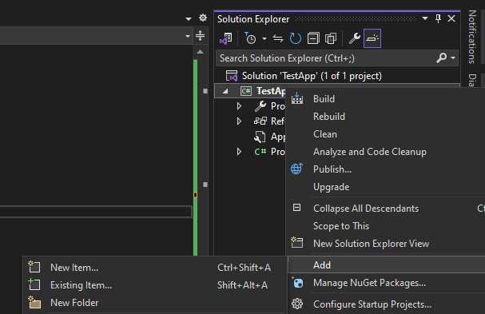
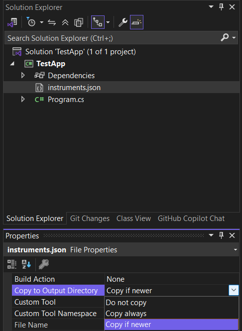
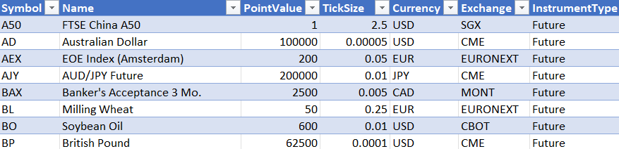

# Instruments
To accurately backtest an instrument, more information is needed than just price. `BarSeries` expose a property `Instrument` which contains key contract specifications used to calculate P&L's.
## Required fields
The following fields are required to define a valid instrument for backtesting:

- Symbol
- Instrument type
- Point value
- Tick size
- Currency

> [!NOTE]
> If not specified, currency is assumed to be the base currency found in the SettingsManager, which defaults to USD unless overridden.

The code snippet below creates an instrument for the 30Yr Treasury Bond future which trades in 32nd's (i.e. a tick size of 0.03125) and has a point value or multiplier of $1000 (i.e. a one point move is worth $1000 per contract).
```csharp
new Instrument("US", InstrumentType.Future, 1000, 1D / 32);
```

## Instrument file
An instrument file is a simple json or xml document containing instrument definitions. If a file named "instruments.json" (or "instruments.xml") is found within a data directory, a `BarServer` will use it to populate the `Instruments` collection and set the `BarSeries.Instrument` property automatically when a symbol is loaded. If no instrument file exists, or a symbol is not found within the instrument file, most BarServers will assume a default instrument of a generic equity with a tick size of 0.01 and point value of 1.

### Creating an instrument file
The easiest way to create an instrument file is to create a new `InstrumentCollection`, add the instruments of interest, and then call `Save()`. In the example below we add two instruments, WTI Crude Oil with the minimum required properties specified, and the Euro Bund contract with additional information. Although there are only a handful of required properties, the backtester will use any additional properties, if available, to do things like calculate margin requirements, group performance results by sector, etc.

```C#
var instruments = new InstrumentCollection();
instruments.Add(new Instrument("CL", InstrumentType.Future, 1000, 0.01));
instruments.Add(new Instrument
{
    Symbol = "FGBL",
    Name = "Bund",
    InstrumentType = InstrumentType.Future,
    PointValue = 1000,
    TickSize = 0.01,
    Currency = "EUR",
    Sector = "Fixed Income",
    Months = "HMUZ",
    Exchange = "EUREX",
    InitialMargin = 1995,
    AltIdentifier = "RX"
});
instruments.Save(@"c:\temp\instruments.json");
```
The resulting json file will look like this:

```json
[
  {
    "Symbol": "CL",
    "PointValue": 1000.0,
    "TickSize": 0.01,
    "InstrumentType": "Future",
    "Currency": "USD"
  },
  {
    "Symbol": "FGBL",
    "Name": "Bund",
    "PointValue": 1000.0,
    "TickSize": 0.01,
    "InstrumentType": "Future",
    "Currency": "EUR",
    "Exchange": "EUREX",
    "InitialMargin": 1995.0,
    "Sector": "Fixed Income",
    "AltIdentifier": "RX",
    "Months": "HMUZ"
  }
]
```

### Conversion factors
Some data providers use quoting conventions that don't necessarily match the exchange or perhaps you would simply prefer to see an instrument quoted in a different format. The `ConversionFactor` property can be specified for an instrument and is used to adjust prices, typically by shifting the decimal place by applying a factor like 100 or 0.01. Most built-in bar servers will automatically apply the conversion factor when a series is loaded.

> [!IMPORTANT]
> For conversion factors other than the default of 1, you will need to manually adjust the point value and tick size in the instrument file as needed. This is not done automatically.

### Global instrument file
If no instrument file is found in the data directory, a `BarServer` will check the directory where the program is running to see if it can find a global instrument file. A global instrument file is useful when you use the same symbology or data provider across multiple directories. The backtester includes an [instrument file](..\instruments.json) with contract specifications for common CSI symbols that can be used for this purpose.

To add this to your Visual Studio project, first save [instruments.json](..\instruments.json) to your local drive. Right click on the project and select 'Add' and then 'Existing item'. Navigate to where you saved the instruments file, highlight it, and click 'Add'.



After instruments.json has been added to your project, remember to set the 'Copy to Output Directory' property to 'Copy always' or 'Copy if newer' so the backtester can find the instrument file in the output directory when it runs.



### Excel
Large and/or complex instrument files can also be created or manipulated with Excel by saving the spreadsheet as an xml file. Since `InstrumentCollection` can read and write both json and xml files, I recommend you convert the instruments.json file included with the backtester to use as a starting point.

```csharp
InstrumentCollection.Load("instruments.json").Save("instruments.xml", PersistenceFormat.Xml);
```
You should now be able to open the resulting xml file in Excel. Be sure to save any changes as file type 'XML Data (*.xml)' in Excel.

