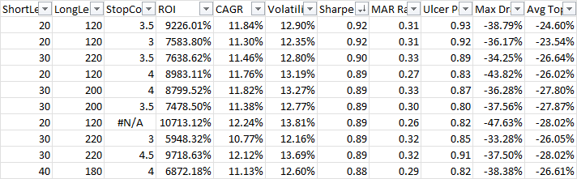

# Optimization
A common task when developing trading strategies is optimizing performance with respect to key parameters. This is very easy to do with the backtester by applying a special attribute to the properties you are interesting in optimizing. Let's modify the example strategy we have been working with further to support optimization. 

## Optimization attributes
```csharp
class SimpleSma : Strategy
{
    [Optimize(20, 80, 10)]
    public int ShortLength { get; set; } = 50;

    [Optimize(120, 240, 20)]
    public int LongLength { get; set; } = 200;

    [Optimize(3, 5, 0.5, includeNaN: true)]
    public double StopCoefficient { get; set; } = 3;

    protected override void OnStrategyStart()
    {
        Col1 = Sma(Close, ShortLength);
        Col2 = Sma(Close, LongLength);
        Col3 = Atr(21);

        Plot(Col1, 0, Color.Blue);
        Plot(Col2, 0, Color.Red);
        Plot(PlotInstruction.PlotStops);
    }

    protected override void OnBarClose()
    {
        if (CrossAbove(Col1, Col2).Last)
        {
            Buy();
        }
        else if (Col1.Last < Col2.Last)
        {
            Sell();
        }

        ExitOnStop();
    }

    protected override void OnPositionOpening(Position position)
    {
        base.OnPositionOpening(position);
        position.Stop = position.Entries.AvgGrossPrice - Col3.Last * StopCoefficient;
    }
}
```
 On lines 3, 6 and 9 we applied the `Optimize` attribute to each property. There are several ways to specify optimization attributes but the most common is to use start, stop and step parameters. In this example, the `ShortLength` will be tested from 20 to 80 in steps of 10 and the `LongLength` will be tested from 120 to 240 in steps of 20. Rather than hard-coding a 3 ATR protective stop as before, we parameterize it by adding a new `StopCoefficient` property on line 10. The stop will be optimized from 3 to 5 ATR's in half ATR increments and will also include NaN in the list of values to be tested. NaN stands for "not a number." When you introduce NaN into a calculation, the result will be NaN, similar to null propogation in databases. NaN is not a valid stop price, therefore this is an easy way to test not using a stop at all without having to introduce any other logic.

## Running an optimization
The backtester has several different optimizers but the `Optimizer` class, which uses simple brute force optimization to test all possible parameter combinations, is most commonly used. In the code below, we load data, create the strategy and assign a money manager, before passing the strategy and data into the `Optimize()` method. The optimizer will run the strategy across all symbols for each parameter combination, then run a money management simulation to build the equity curve and calculate portfolio statistics, and finally save the results to a `TradeStatsCollection` object. By default, optimization results will be automatically exported to Excel on Windows machines. Optimization results can also be saved to disk by calling the `Save()` method and recovered by using the `TradeStatsCollection.Load()` method.

```csharp
var server = new CsiBarServer(@"c:\data");
var data = server.LoadAll();

var strat = new SimpleSma();
strat.MoneyManager = new FixedFractional { PercentToRisk = 0.001 };

var optimizer = new Optimizer();
optimizer.Optimize(strat, data);
optimizer.GetResults().Save(@"c:\temp\optimizationResults.tsc");
//var results = TradeStatsCollection.Load(@"c:\temp\optimizationResults.tsc")
```
When you run this code, the optimizer will began stepping through each parameter combination in turn.

```
Property to optimize: ShortLength (20 to 80 by 10)
Property to optimize: LongLength (120 to 240 by 20)
Property to optimize: StopCoefficient (3 to 5 by 0.5)
Total iterations 294. 0 skipped due to binding constraints.
Optimization run 1 of 294 . . .
Running FixedFractional money management simulation . . .
Calculating results . .  .
Sharpe: 0.93 Trades: 2,456 {"ShortLength":20,"LongLength":120,"StopCoefficient":3}
Elapsed RunTime: 00:00:03.8646155 Estimated Completion Time: 5:04:37 PM Estimated Time Remaining: 0:18:52
Optimization run 2 of 294 . . .
Running FixedFractional money management simulation . . .
Calculating results . .  .
Sharpe: 0.93 Trades: 2,456 {"ShortLength":20,"LongLength":120,"StopCoefficient":3.5}
Elapsed RunTime: 00:00:07.1922093 Estimated Completion Time: 5:03:18 PM Estimated Time Remaining: 0:17:30
Optimization run 3 of 294 . . .
```
### Multi-threaded optimizations
In the output above you can see that we ran 294 different parameter combinations. This test ran on 48 symbols totaling over 435,000 daily bars. Even on a fast machine, this can take a while. A more efficient method is to leverage the multiple cores of a modern CPU. Rather than creating a strategy and associated money manager directly, we can pass in the type and take advantage of multi-threaded optimizations. Below we pass in the type of strategy we are interested in optimizing rather than a concrete instance of it. We also pass in a money manager type. Since we want to risk 10 basis points but the default `FixedFractional`.`PercentToRisk` value is higher, we pass in a `VariableDictionary` so the optimizer can set properties of the money manager before the simulation is run. A `VariableDictionary` is simply a dictionary of objects indexed by a key. This also works for the strategy type and is typically used to set transaction costs or other simulation options, but in this case we simply passed in null. 

```csharp
var optimizer = new Optimizer();
optimizer.Optimize(typeof(SimpleSma), null, typeof(FixedFractional), new VariableDictionary { { "PercentToRisk", 0.001 } }, data);
```
```
Property to optimize: ShortLength: (20 to 80 by 10)
Property to optimize: LongLength: (120 to 240 by 20)
Property to optimize: StopCoefficient: (3 to 5 by 0.5) + NaN
Total iterations 294. 0 skipped due to binding constraints.
Optimization run 1 of 294 . . .
Returning node BALSAM2-0
Released node BALSAM2-0 back to pool. InUse=0 Available=1 Offline=0
Sharpe: 0.93 Trades: 2,456 {"ShortLength":20,"LongLength":120,"StopCoefficient":3}
Elapsed RunTime: 00:00:01.7818623 Estimated Completion Time: 4:57:36 PM Estimated Time Remaining: 0:08:42
Optimization run 2 of 294 . . .
Returning node BALSAM2-0
Released node BALSAM2-0 back to pool. InUse=0 Available=1 Offline=0
Sharpe: 0.93 Trades: 2,456 {"ShortLength":20,"LongLength":120,"StopCoefficient":3.5}
Elapsed RunTime: 00:00:03.5198290 Estimated Completion Time: 4:57:30 PM Estimated Time Remaining: 0:08:33
```
We were able to cut the time by more than in half by using multiple threads. Daily simulations already run so fast that gains from parallel backtesting are dimished by the housekeeping of running multiple threads. But when working with intraday data and millions of bars, the performance gains from multi-threaded backtesting can be quite substantial.

### Optimization reporting
When an optimization run is complete, results are automatically exported to Excel. The first columns show the properties that were optimized followed by some standard performance statistics.



You can output a custom format by passing the fields of interest to the `ExportToExcel()` method. 
```c#
optimizer.GetResults().ExportToExcel(TradeStatFields.SortinoRatio, TradeStatFields.Expectation);
//TradeStatFields are simply static string constants. You can also pass in strings directly
optimizer.GetResults().ExportToExcel("SortinoRatio", "Expectation")
```
The default optimization report format can also be changed via the `SettingsManager.Default.OptimizationReportFields` property. See how to change [default settings](../howto/ChangeDefaultSettings.md) for more information.