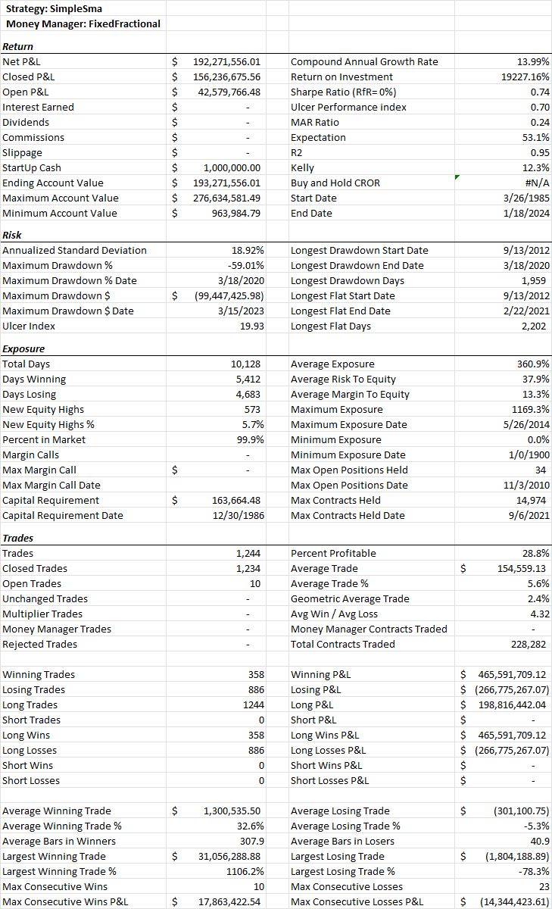
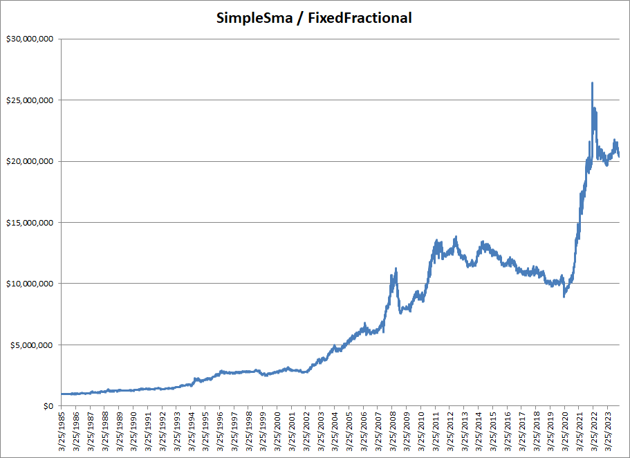
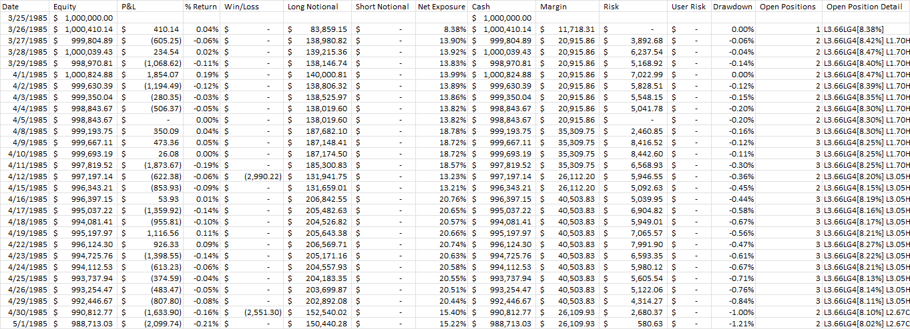
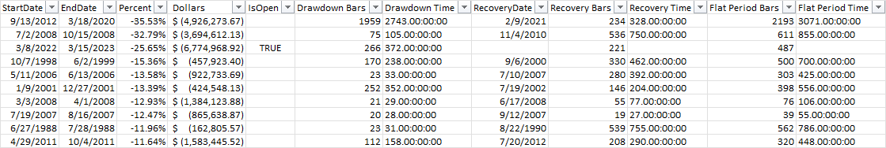
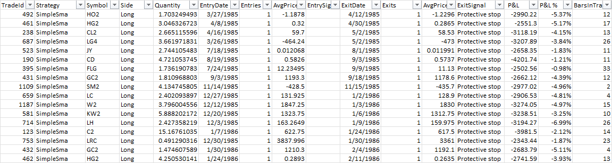
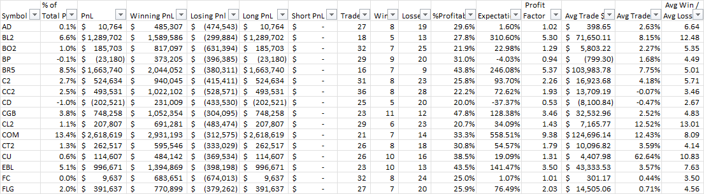
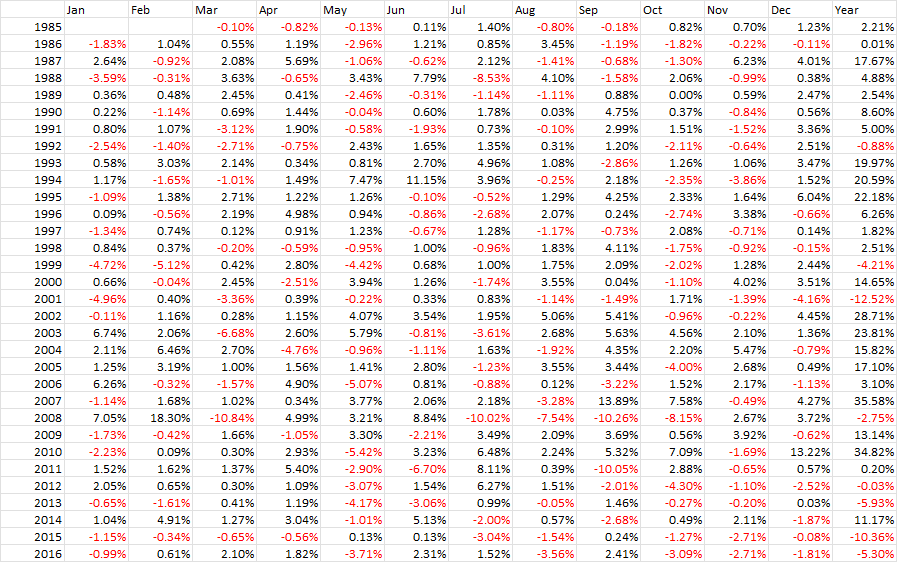
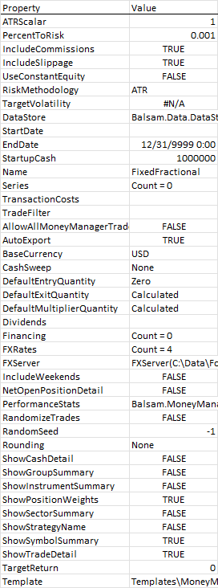

# Putting it all together
Now that we have a basic understanding of instruments, bar servers, strategies and money managers, let's put them together to run our first backtest. Assuming you have followed the instructions in [Getting Started](GettingStarted.md) and have created an empty .NET Console application, you can paste the following into the Program.cs file, overwriting the stub code that may have been produced by Visual Studio.

```csharp
using Balsam;
using Balsam.DataServers;
using Balsam.MoneyManagement;
using System;
using System.Drawing;

internal class Program
{
    static void Main(string[] args)
    {
        //change the BarServer type and directory as needed to point to your own data
        var server = new CsiBarServer(@"c:\data\csi\current");
        var data = server.LoadAll();
        var strat = new SimpleSma();
        strat.MoneyManager = new FixedFractional() { PercentToRisk = 0.001 };
        strat.RunSimulation(data);
    }
}

class SimpleSma : Strategy
{
    public int ShortLength { get; set; } = 50;

    public int LongLength { get; set; } = 200;

    protected override void OnStrategyStart()
    {
        Col1 = Sma(Close, ShortLength);
        Col2 = Sma(Close, LongLength);
        Col3 = Atr(21);

        Plot(Col1, 0, Color.Blue);
        Plot(Col2, 0, Color.Red);
        Plot(PlotInstruction.PlotStops);
    }

    protected override void OnBarClose()
    {
        if (CrossAbove(Col1, Col2).Last)
        {
            Buy();
        }
        else if (Col1.Last < Col2.Last)
        {
            Sell();
        }

        ExitOnStop();
    }

    protected override void OnPositionOpening(Position position)
    {
        base.OnPositionOpening(position);
        position.Stop = position.Entries.AvgGrossPrice - Col3.Last * 3;
    }
}
```
## Code discussion
### Namespaces
Namespaces are used to group functionality and are accessed with the `using` keyword in C#. We first import the `Balsam` namespace which contains the `Strategy` class as well other foundational classes we have already covered including `TimeSeries`, `BarSeries` and `Instrument`. We also import `Balsam.DataServers` which contains bar servers and data related classes as well as `Balsam.MoneyManagement` for accessing built-in money managers. Finally, the `System.Drawing` namespace is included to be able to easily reference colors for charting.

### Program.Main
The `static void Main(string[] args)` method is the primary entry point for a C# console application. Here we can kick off our first portfolio backtest in only five lines of code. But before we do, let's discuss a few modifications made to our toy `SimpleSma` strategy to make it slightly more realistic.

### OnStrategyStart()
Rather than using hard-coded constants for the moving average lengths, we converted the Sma calculations to use two new properties, `ShortLength` with a default of 50 and `LongLength` with a default of 200. While the code is equivalent to the original system, using properties allows us to easily change the lengths and also supports [optimization](Optimization.md). Next, we assign a 21 day average true range calculation to `Col3` and then add three plot instructions which will be used when charting the strategy.

### OnBarClose()
In the original `SimpleSma` example, the entry logic used a comparison of `Col1.Last > Col2.Last` (i.e. the 50 day SMA is greater than the 200 day SMA.) We've modified this to leverage a built-in indicator to detect crosses of one series versus another. The `CrossAbove` indicator returns a `BooleanSeries`. Notice how we reference `.Last` to get the most recent value relative to the current date being tested. Using crosses instead of a simple comparison is a common trick to ensure you enter a trade only once when the initial condition is true. This becomes particularly important when using a stop. Otherwise, if you get stopped out of a trade, you could potentially re-enter on the very next bar when using simple comparison logic like `Col1.Last > Col2.Last`.

We also add a call to `ExitOnStop()`. This is a built-in helper method which evaluates the current position and then calls the appropriate stop method depending on the position side. If we were to code this manually, it would look something like this:
```csharp
if (MarketPosition == PositionSide.Long)
{
    SellStop(CurrentPosition.Stop);
}
else if (MarketPosition == PositionSide.Short)
{
    CoverStop(CurrentPosition.Stop);
}
```
`MarketPosition` returns an enum value of `Long`, `Flat` or `Short`. You can use this to check if you have a position (`CurrentPosition != null` works too). Finally, we call the appropriate stop order method, passing in the stop price to be used. But it's a lot simpler to just call `ExitOnStop()` which does all this work for you. You'll find the backtester has a lot functionality like this designed to hide the underlying complexity and speed the research process.

### OnPositionOpening()
`OnPositionOpening()` is called when an opening trade is executed, thereby creating a new position. This is a perfect place to initialize a stop loss or target. The `Position` object has both `Stop` and `Target` properties which can be leveraged for this functionality. Here we set a protective stop at 3 ATR's off the gross entry price (ignoring slippage and commissions.)

## Running a backtest
With the strategy code explanation out of the way, let's come back to how we actually run a backtest. There are generally three parts: a strategy, a money manager, and the data being tested. In this example we are using `CsiBarServer` to load end-of-day backadjusted continuous futures contracts exported from CSI's Unfair Advantage software. You will likely need to adjust the type of `BarServer` and the data directory as required to point to your own files. See [Data](Data.md) for examples of other BarServers that could be used as alternatives. If you are using CSI, consider adding a global instrument file included with the backtester to your project as described in [Instruments](Instruments.md).
```csharp
var server = new CsiBarServer(@"c:\data\csi\current");
var data = server.LoadAll();
```
Next we create an instance of our strategy, assign a fixed fractional money manager risking 10 basis points per trade, and pass in the data to be tested to `RunSimulation()`.

```csharp
var strat = new SimpleSma();
strat.MoneyManager = new FixedFractional() { PercentToRisk = 0.001 };
strat.RunSimulation(data);
```
Hit F5 in Visual Studio to build and run the program. It should only take a few seconds to run and when the simulation is complete, a backtest report will be exported to Excel. Congratulations! You have just run your first backtest.

## Backtest report
Backtest reports are generated using customizable Excel templates. The default money management template 'MoneyManagementTemplate' looks like this:

### Performance Stats
'Performance Stats' is the first worksheet of the backtest report and contains key portfolio metrics and trade statistics.



### Equity Curve
The next page contains a chart of the end-of-day account balance, commonly called an equity curve.


### Equity Detail
The Equity Detail tab contains daily equity, return, exposure, margin, and open position information.


### Drawdowns
The Drawdowns tab contains detailed information on all drawdowns in the equity curve sorted by the worst percentage drawdown.


### Trade Detail
The Trade Detail tab contains detailed information on individual trades.


### Symbols
The Symbols tab shows performance statistics aggregated by symbol. Group, Sector, and Instrument performance summaries can also be enabled by setting the appropriate property in `MoneyManager.Options` before running the simulation, assuming that information is available in your instruments file.


### Performance grid
Next we have a standard performance grid allowing you to see monthly and annual performance at a glance.


### Settings
Finally, the Settings tab contains various settings used by the money manager that generated the report.



### Alternative templates
 When running many tests you may prefer to work with a streamlined template displaying a few key stats in a single column. This makes it easier to copy and paste results within Excel for side-by-side comparisons. For the built-in 'ComparisonTemplate', try setting the money manager `Template` property as shown below:
 ```csharp
var strat = new SimpleSma();
strat.MoneyManager = new FixedFractional() { PercentToRisk = 0.001 };
strat.MoneyManager.Options.Template = "ComparisonTemplate";
strat.RunSimulation(data);
 ```
See [Customizing backtest reports](../howto/CustomizeBacktestReports.md) for more information on customizing templates.