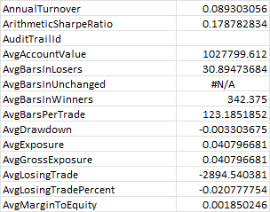
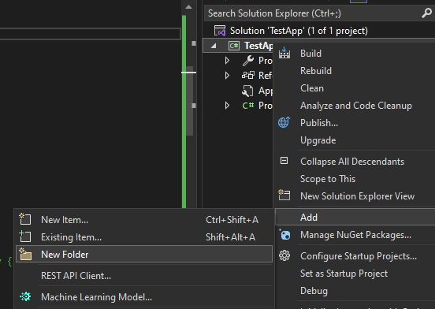
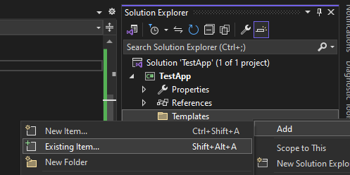
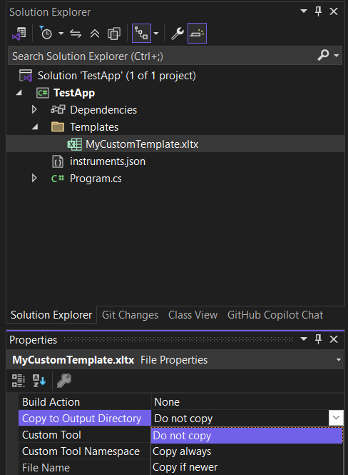

## Customizing backtest reports
### Templates
The default report writer in the Balsam.Reporting library uses Excel for its output. It's familiar, customizable, and ubiquitous. The look and feel of these backtest performance reports is controlled by Excel templates. The backtester currently contains two built-in money management templates, 'MoneyManagementTemplate' and 'ComparisonTemplate', and one strategy template, 'StrategyTemplate', used for exporting strategy results without a money manager attached. These can be used as a starting point to customize reports to suit your needs.
### Change the default template
If no template has been specified, the backtester uses a built-in default. To use a different template, set the `MoneyManager.Options.Template` property. Or, for a more permanent solution, [override the default](ChangeDefaultSettings.md) by changing the `MoneyManagementTemplate` property in `SettingsManager`.
```csharp
var mm = new FixedFractional() { PercentToRisk = 0.001 };
mm.Options.Template = "ComparisonTemplate"; //the built-in single-column comparison template
mm.Options.Template = @"C:\temp\MyCoolTemplate.xltx"; //a custom template residing on disk; relative paths are fine too.
mm.DataStore = Balsam.Data.DataStore.Load(@"c:\temp\simpleSma.bds");
mm.RunSimulation();
```
### Create a custom template
After running a backtest using the built-in template, you'll notice the 'Performance Stats' worksheet uses VLOOKUP formulas to display backtest performance statistics. Templates contain a hidden worksheet called '_Data' where the backtester dumps raw performance statistics. Unhide the _Data worksheet in Excel to see what fields are available. To create you own custom template, start with an existing template. Modify the 'Performance Stats` worksheet using Excel VLOOKUP formulas to pull the desired values from the _Data worksheet and then format as needed for display. Be sure to save your creation as an Excel template (file type .xltx). [Change your default settings](ChangeDefaultSettings.md) to use this new template going forward or set the template before running a simulation as shown above.



### Templates folder
Rather than typing absolute paths you may find it easiest to create a Templates folder to store custom templates for easy access. Right click on your project, select 'Add' and then 'New Folder'. Name this new folder "Templates".



Next, right click on the Templates folder, select 'Add', and then 'Existing item'.



Navigate to where your custom template(s) are stored, make sure the file mask in the lower right is set to 'All Files (\*.\*)', select the existing template(s) and then click 'Add'. Copies of these templates will now be contained in your Templates folder. From the Properties window, select the templates and change the 'Copy to Output Directory' property from 'Do not copy' to 'Copy if newer'.



You can now direct a money manager to use this template like so:
```csharp
var mm = new FixedFractional();
mm.Options.Template = @"Templates\MyCustomTemplate.xltx";
```

## Custom performance stats
You can also create custom performance metrics by extending the `PerformanceStats` class. For example, if we wanted to report the correlation of our system's returns to a benchmark we could create a custom performance stats class and override the `OnCalculate()` method.

```c#
class CustomPerformanceStats : PerformanceStats
{
    public double CorrelationToBenchmark
    {
        get;
        private set;
    }

    protected override void OnCalculate(TimeSeries equityCurve)
    {
        base.OnCalculate(equityCurve); //be sure to call the base implementation

        var benchmark = TimeSeries.Load(@"c:\data\benchmark.csv"); //this assumes Date,Close format
        CorrelationToBenchmark = Indicators.Correlation(benchmark.PercentChange(), GetDailyReturns());
    }
}
```
Next we need to inform the money manager assigned to our strategy to use this custom class by setting the `Options.PerformanceStats` property. 
```c#
var mm = new FixedFractional();
mm.Options.PerformanceStats = typeof(CustomPerformanceStats);
```
Alternatively, we could set the `SettingsManager.Default.MoneyManagerOptions.PerformanceStats` property which acts as the default when money managers are created.

```c#
SettingsManager.Default.MoneyMangagerOptions.PerformanceStats = typeof(CustomPerformanceStats);
SettingsManager.Default.Save();
```

When we run the backtest, the `CorrelationToBenchmark` value will be output to the hidden _Data worksheet. To display this stat on the "Performance Stats" worksheet you will also need to create a new custom template or modify an existing one. See [custom template](#create-a-custom-template) above for instructions.
### Custom report writers
If Excel templating does not meet your needs you can implement the `IReportWriter` interface to write custom reports to any destination. Set the `SettingsManager.Default.ReportWriter` to an instance of your new reporting class to override the Excel output.