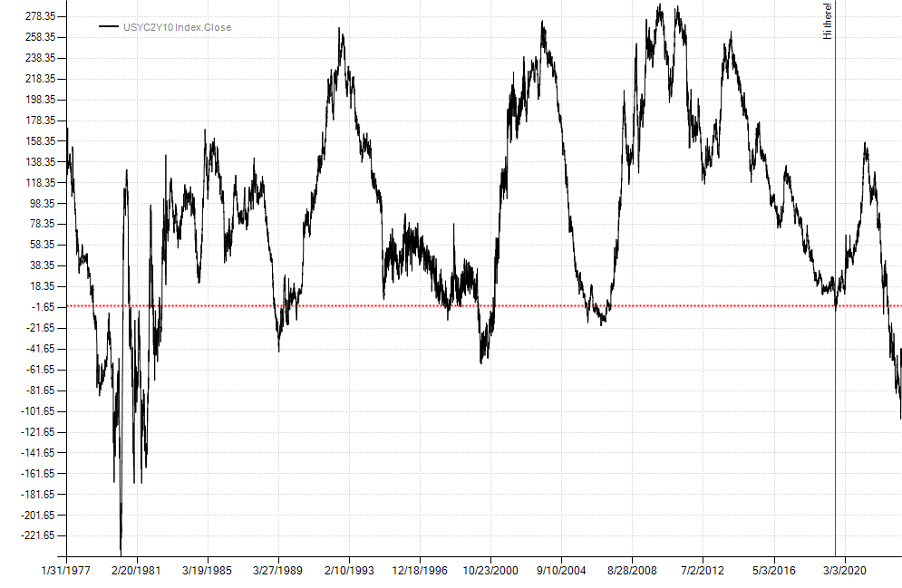

## Create stand-alone charts
Sometimes it's helpful to create charts independently of a strategy. This can be done by passing plot instructions to the `Chart` class found in the `Balsam.Charting` namespace. In the example below, we plot the 2-10 yield curve with a horizontal line on the y-axis and a vertical line on the x-axis. Finally, we save the chart to a file before calling the `ShowDialog()` method on `ChartForm`. `ChartForm` is a Windows Form specifically designed for displaying charts. If you are building GUI's in Windows, `Chart` may be used as a WinForms component and can also be used by WPF apps with the`WindowsFormsHost` control.

```csharp
var twoTen = BarSeries.Load(@"c:\data\temp\USYC2Y10 Index.csv").Close;
var cht = new Chart();
cht.Plot(new PlotInstruction { Series = twoTen },
    new PlotInstruction { YValue = 0, Color = Color.Red, LineStyle = "Dot", Width = 2 },
    new PlotInstruction { XValue = new DateTime(2019, 8, 27), Color = Color.Green, Text = "Hi there!" });
cht.SaveImage(@"c:\temp\myChart.png", ChartImageFormat.Png);
new ChartForm(cht).ShowDialog();
``` 
