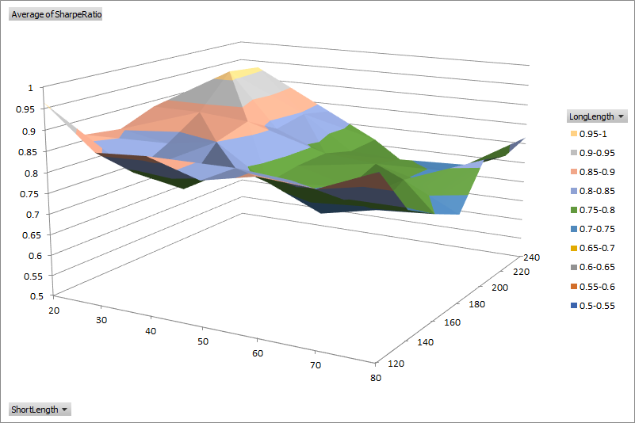

## Visualize optimization results
The default optimization report has a filter enabled on the header row to allow for easy sorting and filtering of results. A surface chart can be helpful to visualize the interaction between two different parameters at a glance. For example, using data from the [Optimization](../docs/Optimization.md#optimization-reporting) example, we can plot the Sharpe Ratio with respect to the short and long moving average lengths.



To create surface charts automatically from an optimization report, place the following macro in your Excel Personal Macro Workbook and assign a hotkey.
```vb
Public Sub CreateSurfaceChart()

    Dim r As Range
    Dim ws As Worksheet
    Dim pivot As PivotTable
   
    Range("A1").Select
    Range(Selection, Selection.End(xlToRight)).Select
    Range(Selection, Selection.End(xlDown)).Select
    Set r = Selection
    
    Set ws = Sheets.Add
    ActiveWorkbook.PivotCaches.Create(SourceType:=xlDatabase, SourceData:= _
        r, Version:=xlPivotTableVersion14).CreatePivotTable _
        TableDestination:=ws.Name & "!R3C1", TableName:="PivotTable1", DefaultVersion _
        :=xlPivotTableVersion14
    ws.Select
    ws.Cells(3, 1).Select
    
    Set pivot = ws.PivotTables("PivotTable1")
    
    With pivot.PivotFields(1)
        .Orientation = xlRowField
        .Position = 1
    End With
    
    With pivot.PivotFields(2)
        .Orientation = xlColumnField
        .Position = 1
    End With
    
    pivot.AddDataField pivot.PivotFields("Sharpe Ratio"), "Average of SharpeRatio", xlAverage
    
    ws.Shapes.AddChart.Select
    ActiveChart.ChartType = xlSurface
    
    Set r = ws.Range(ws.Cells(3, 1), ws.Cells(3, 1).Offset(pivot.RowFields.Count, pivot.ColumnFields.Count))
    ActiveChart.SetSourceData Source:=r
    
    ws.Shapes(1).Top = 50
    ws.Shapes(1).Left = 50
    ws.Shapes(1).Width = 600
    ws.Shapes(1).Height = 400
    
End Sub
```